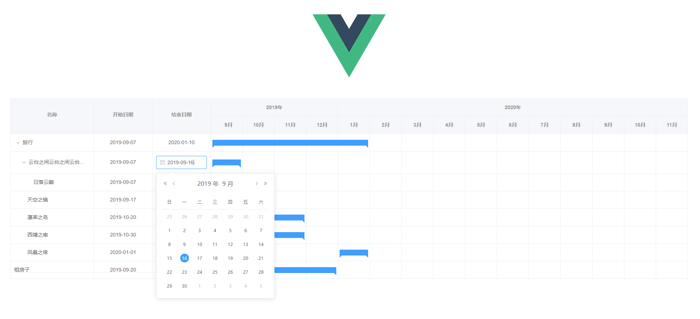

# wl-gantt

# 简介

  目前市面上最有名的几个gantt插件占据江湖了非常久远的时间，它们古老又强大。 
    但无一例外的是：它们收费或极其难用并且依赖非常古老的技术，其中有些技术现在入行的新手甚至从未听闻。  
      【jQueryGantt】【plusgantt】【dhtmlx】  
        不可否认它们都非常的强大，不管是从性能还是功能性。但是大多的业务需求并不需要如此庞然大物才能满足需求。    
          另一方面古老的技术稀缺的文档又让开发者无从下手（收费版甚至不提供文档，而你的老板又肯定不会提供钱买下授权）。
              `【wl-gantt】`出现的背景就是笔者在公司的Vue项目中使用B***Gantt插件所受到的巨大伤害：基于extjs（对于17年入行的我来说没听过）、不提供开发文档、没有中文资料、源码加密，开发全靠打印实例找属性。 
            wl-gantt是一个基于Vue及elementUi的gantt甘特图插件，是一个896的码奴在仅有的剩余的1中挤时间开发而成。   
              它目前仅提供了很少的功能：自动检查源数据是否符合project任务安排规则，结束后开始的前置任务规则。yearAndmonth的gantt时间跨度。    
                但它绝对简单易用，并且高度可配置。  
                它的实际年龄才只有3天，它正在我和所有热爱开源事业的朋友们手中逐渐长大。   
                下个阶段，它将学会：    
                1. yearAndMonth、monthAndDay、yearAndWeek时间跨度配置 【已完成，month及week格子起止位置待精确化】
                2. 内置前置任务选择器   
                3. 整合树表全选联动功能
                4. 任务连接线   
                5. 任务自定义悬浮提示   
                6. 和所有你觉得需要用到的需求 

## [在线演示](https://hql7.github.io/)
## [GitHub](https://github.com/hql7)

### 更新说明
  > 2019-12-3 更新gantt。1表格支持[el-table](https://element.eleme.cn/#/zh-CN/component/table)大部分`Attributes`和`Events`,详细列表见下方；2名称列增加`nameFormatter`格式化内容函数支持；3日期列改为点击显示编辑输入框的形式。  
  > 2019-12-2 更新gantt.1日期支持` yearAndMonth、monthAndDay、yearAndWeek`类型，详见`版本记录1`；2修复部分时间更改情况不回调的问题。

##### Demo


#### 已支持el-table参数及事件列表
```
    :fit="fit"
    :size="size"
    :border="border"
    :data="selfData"
    :stripe="stripe"
    :height="height"
    :row-key="rowKey"
    :row-style="rowStyle"
    :class="dateTypeClass"
    :cell-style="cellStyle"
    :max-height="maxHeight"
    :tree-props="selfProps"
    :current-row-key="rowKey"
    :row-class-name="rowClassName"
    :cell-class-name="cellClassName"
    :expand-row-keys="expandRowKeys"
    :header-row-style="headerRowStyle"
    :header-cell-style="headerCellStyle"
    :default-expand-all="defaultExpandAll"
    :header-row-class-name="headerRowClassName"
    :highlight-current-row="highlightCurrentRow"
    :header-cell-class-name="headerCellClassName"
    @header-contextmenu="handleHeaderContextMenu"
    @selection-change="handleSelectionChange"
    @row-contextmenu="handleRowContextMenu"
    @current-change="handleCurrentChange"
    @cell-mouse-enter="handleMouseEnter"
    @cell-mouse-leave="handleMouseLeave"
    @expand-change="handleExpandChange"
    @filter-change="handleFilterChange"
    @cell-dblclick="handleCellDbClick"
    @header-click="handleHeaderClick"
    @row-dblclick="handleRowDbClick"
    @sort-change="handleSortChange"
    @cell-click="handleCellClick"
    @select-all="handleSelectAll"
    @row-click="handleRowClick"
    @select="handleSelect"
```

## 快速上手

`npm i wl-gantt --save` 
  
  或  
  
  `npm i wl-gantt -S` 

`import wlGantt from 'wl-gantt'`  

`import "wl-gantt/lib/wl-gantt.css"`  

`Vue.use(wlGantt)`  

## 文档
###  Attributes
  | 序号 | 参数 | 说明 | 类型 | 可选值 | 默认值 | 注意 |
  | ---- | ---- | ---- | ---- | ---- | ---- | ---- |
  | 1 | data | 数据 | Array | - | [] | - |
  | 2 | dateType | gantt图区日期表头类型 | String | monthAndDay、yearAndMonth、yearAndDay | yearAndMonth | - |
  | 3 | treeProps | 树表配置项 | Object | - | - | 见下方props |
  | 4 | startDate | 项目开始时间 | String、Object | 必填 |-| 注意：不要求任务时间线在项目开始时间内，并且当任务时间超出项目时间时，将更新项目时间 |
  | 5 | endDate | 项目结束时间 | String、Object | 必填 | - | 注意：不要求任务时间线在项目开始时间内，并且当任务时间超出项目时间时，将更新项目时间 |
  | 6 | checkSource | 是否检查源数据符合规则 | Boolean | - | - | 检查源数据为自动修改不符合规范的时间为符合规则的期望值 |
  | 7 | treatIdAsIdentityId | 是否使用id来作为自增id | Boolean | - | false | 如果是请保证id本来就简短的数字型而不是较长的字符串或guid |
  | 8 | autoGanttDateType | 自动调整gantt时间跨度类型，具体规则见`版本记录1` | Boolean | - | true | - |
  | 9 | nameFormatter | 名称列格式化内容函数 | Function | - | - | Function(row, column, cellValue, index) |
  | 10 | 其他Table Attributes | [文档地址](https://element.eleme.cn/#/zh-CN/component/table) | - | - | - | - |

### props
| 序号 | 参数 | 说明 | 默认值 |
| ---- | ---- | ---- | ---- |
| 1 | children | 数据的子集children字段,表示为树表 | children |
| 2 | name | 用于显示名字的字段 | name |
| 3 | id | 每条数据的id，必须唯一 | id |
| 4 | pid | 每条数据的父节点id字段 | pid |
| 5 | startDate | 每条数据的开始时间字段 | startDate |
| 6 | endDate | 每条数据的结束时间字段| endDate |
| 7 | identityId | 数据自增id | identityId |
| 8 | parents | 自增父级id树，逗号分隔 | parents |
| 9 | pre | 前置任务字段，字段值应是前置任务的id | pre |
| 10 | hasChildren | 指定哪些行是包含子节点 | hasChildren |

### Events
  | 序号 | 事件名 | 说明 | 回调参数 |
  | ---- | ---- | ---- | ---- |
  | 1 | timeChange | 当任务时间发生更改时触发 | function(row) 依次为当前行数据 |
  | 2 | 其他Table Events | [文档地址](https://element.eleme.cn/#/zh-CN/component/table) | - | - |

### slot
  | 序号 | 名字 | 说明 |
  | ---- | ---- | ---- |
  | 1 | prv | 用于插入列表中名称前的列，如不生效需加`fixed` |
  | 2 | - | 插入在默认列及甘特图之间的列 |

### 版本记录
> 2. 0.1.6版本 更新gantt。1表格支持[el-table](https://element.eleme.cn/#/zh-CN/component/table)大部分`Attributes`和`Events`；2名称列增加`nameFormatter`格式化内容函数支持；3日期列改为点击显示编辑输入框的形式。注意树表时`rowKey`参数必须传，默认为`id`。

> 1. 0.1.5版本 更新gantt日期支持` yearAndMonth、monthAndDay、yearAndWeek`类型，并自动调整，规则为：大于12个月的自动调整为`yearAndMonth`,3个月到12个月之间的，自动调整为`yearAndWeek`, 2个月及以内的自动调整为`monthAndDay`。新增参数`autoGanttDateType`可以管理是否自动调整，如果要关闭自动调整请保证时间跨度尽可能的少，否则会有明显的性能问题。修复部分时间更改情况不回调的问题。